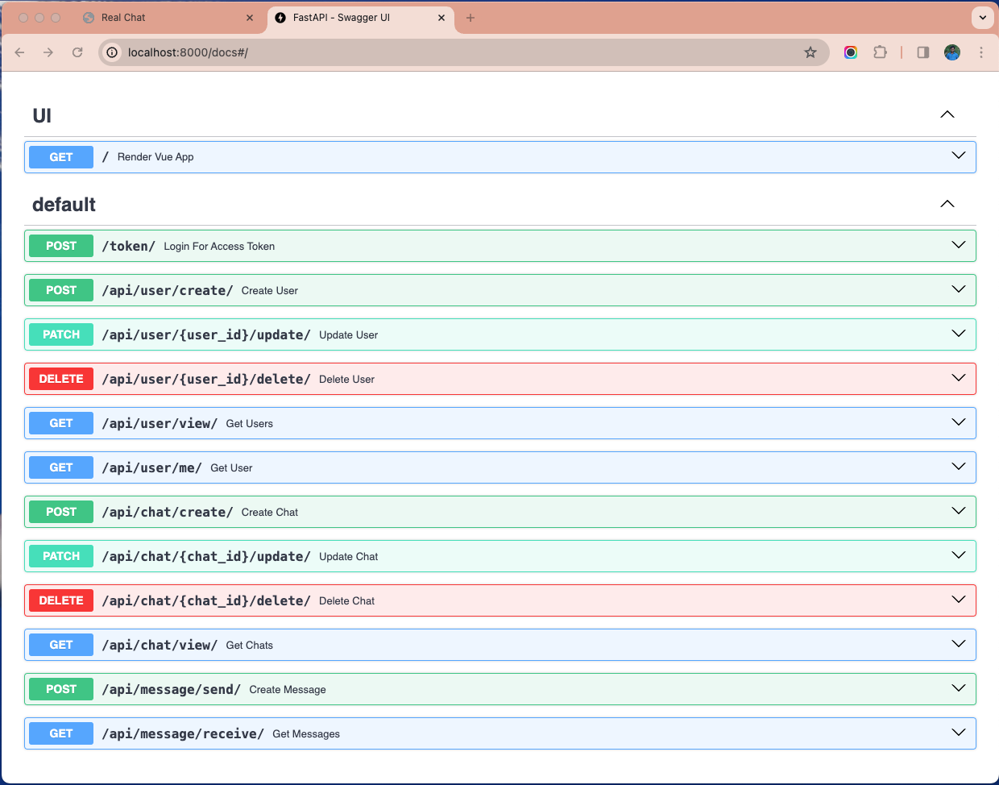
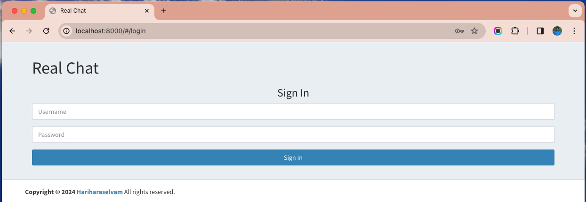
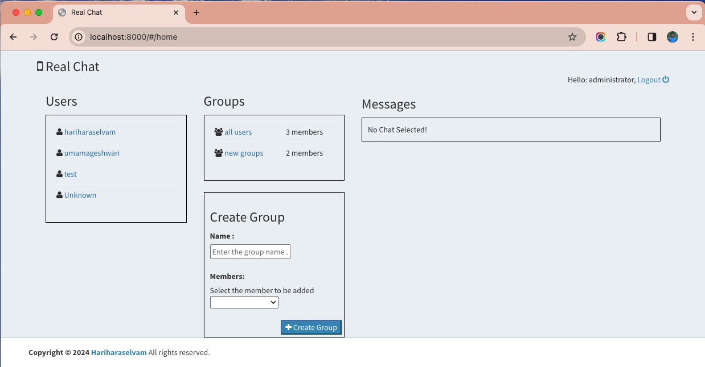
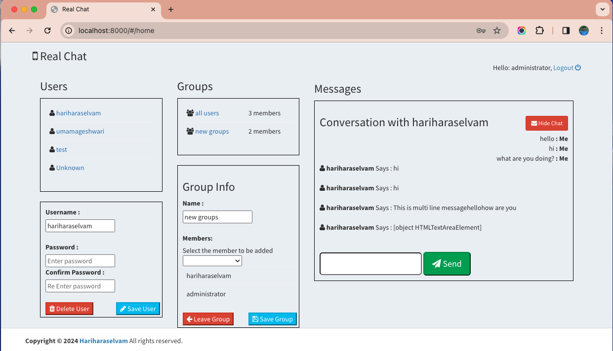
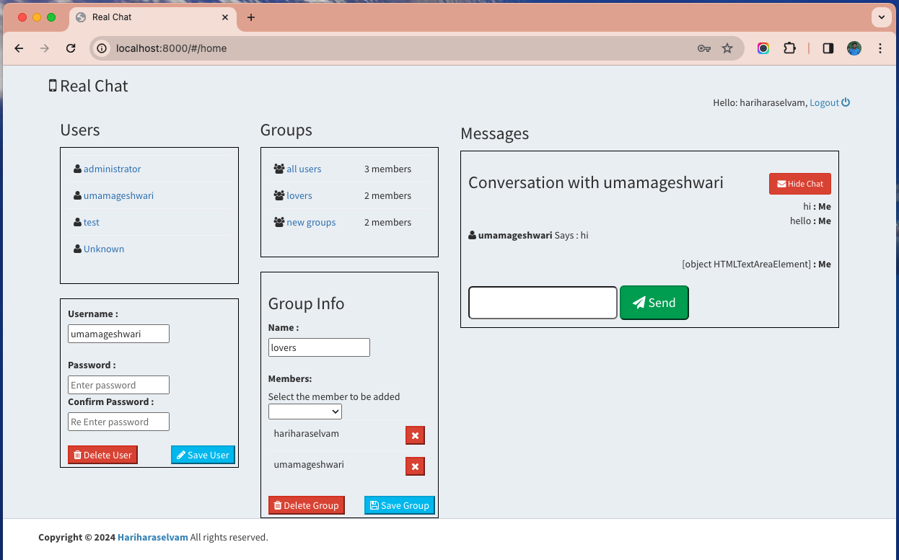

# RealChat

Welcome to the RealChat project! 
This project is built using FastAPI, a modern, fast (high-performance), web framework for building APIs with Python 3.7+ based on standard Python type hints.

## Getting Started

Follow the steps below to set up and run the FastAPI project locally.

### Prerequisites

- Git
- Python 3.7+
- pip (Python package installer)


```
## Clone the Repository
git clone https://github.com/hariharaselvam/RChat.git
cd RChat

## Create Virtual Environment
# On Windows
python -m venv venv

# On macOS/Linux
python3 -m venv venv

## Activate Virtual Environment
# On Windows
venv\Scripts\activate

# On macOS/Linux
source venv/bin/activate

## Install Requirements
pip install -r requirements.txt

## Run FastAPI
uvicorn main:app --reload
```

This will start the FastAPI application locally, and you can access it at http://localhost:8000 in your web browser.

### Access RealChat Application
Open your web browser and navigate to http://localhost:8000 to access the FastAPI application.

## Rules
* admin can create, edit and delete users
* any user can create group and add user to group
* group can be deleted only by creator
* group can be edited by creator and group member
* a member can view group where he is part of
* any user can chat with any other user in private


## Demonstrations

### API Documentation


### Login View


### Default  View


### Group Chat View


### Private View


### Contributing
Feel free to contribute to this project by submitting issues or pull requests.

### License
This project is licensed under the MIT License - see the LICENSE file for details.